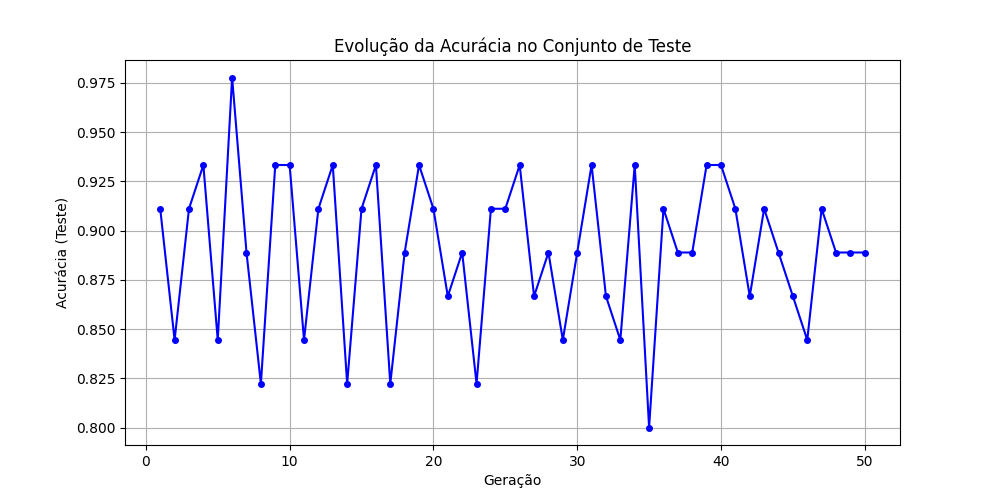
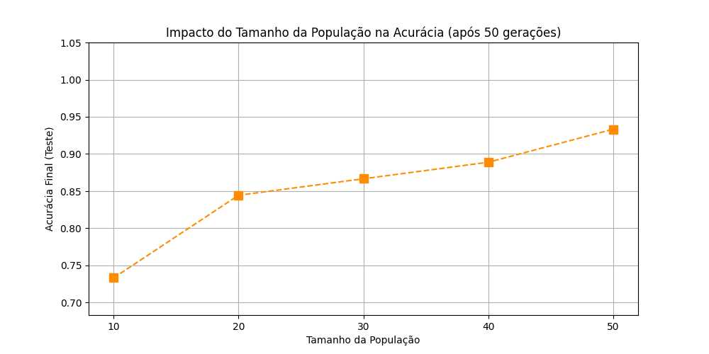

# Classificação de Iris
Implementação de um algoritmo imunológico artificial aplicado à classificação do conjunto de dados Iris, simulando mecanismos do sistema imunológico para resolver problemas de aprendizado de máquina.

## Resultados

